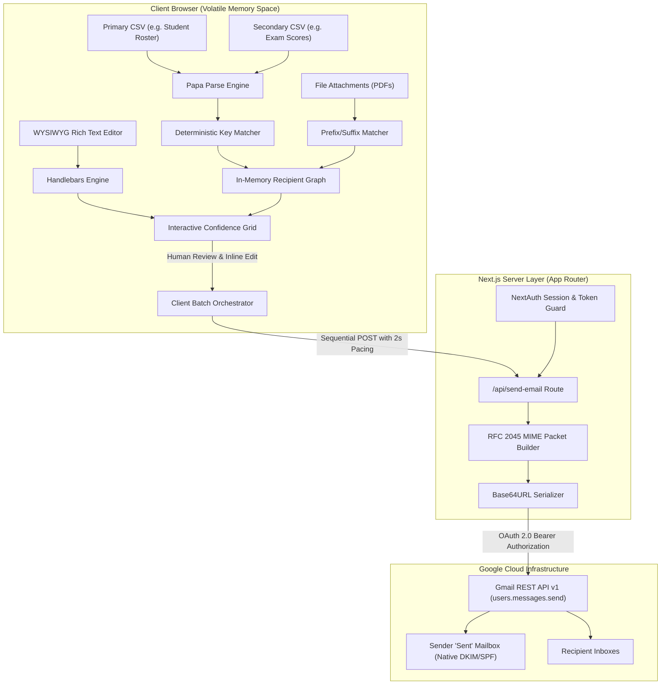
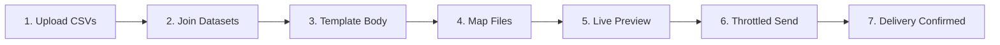

<div align="center">

# Email Automator

**A schema-agnostic, zero-retention bulk email automation tool for educators, teams, and administrators.**  
Merge arbitrary spreadsheets, template personalized messages, auto-match PDF attachments, and safely send directly through your own Google account.

[](https://emailauto.syedmahi.me)

<br/>

[](LICENSE)
[](https://nextjs.org/)
[](https://react.dev/)
[](https://www.typescriptlang.org/)
[](https://cloud.google.com/)
[](docs/ARCHITECTURE.md)

</div>

---

## What Problem Does Email Automator Solve?

Email Automator was built for the messy reality of everyday institutional communication. 

Teachers, university coordinators, and small team leads often sit with two separate spreadsheets—one containing student contact details (`ID`, `Name`, `Student Email`), another containing semester scores or dues (`Roll_No`, `Midterm`, `Final_Grade`)—along with a folder of individual PDF report cards and a strict deadline. 

Traditional email tools create serious friction:
- **Rigid CSV Requirements**: Most tools force you to reformat your spreadsheets to fit a rigid template (e.g., column must literally be named `email`).
- **Privacy & Security Risks**: Handing over sensitive student records or billing data to third-party mass mailers or sharing raw account passwords via SMTP compromises institutional security.
- **Fear of Irreversible Mistakes**: A single misaligned column can deliver private academic records or financial details to the wrong person.

**Email Automator** provides a safe, inspectable bridge: upload your spreadsheets exactly as exported from your school portal or Excel, map your columns visually, preview every rendered email in a live confidence grid, and deliver each message directly from your own Google account.

---

## 🎯 Deterministic Schema-Agnostic Column Mapping

**There is no predefined CSV structure you must follow.** Email Automator accepts any CSV layout and lets you define what columns contain what in the UI:

1. **Flexible Recipient Email Selection**:
   - The system automatically detects candidate email columns, but you have full manual control.
   - Use the **Recipient Email Column** dropdown to select any column in your dataset (`Email`, `User_Mail`, `ParentEmail`, `Contact`, etc.).
2. **Deterministic Multi-Sheet Merging**:
   - Upload two independent CSVs (e.g., Student Master List + Grade Sheet).
   - Use the **Match Columns to Merge Data** selector to join them on any matching key (`ID = Roll_No`, `RegNo = StudentID`, etc.). Matching is whitespace-trimmed and case-insensitive.
3. **Universal Variable Interpolation**:
   - Every column header in your CSV automatically becomes a dynamic Handlebars variable (`{{Name}}`, `{{Physics_Grade}}`, `{{Due_Balance}}`).
   - Click any detected variable pill to insert it directly into your email subject line, body, CC, or BCC fields.
4. **Intelligent Attachment Matching**:
   - Upload a batch of individual files (e.g., `1042.pdf`, `Report-1042.pdf`).
   - Select which column represents the file identifier (`ID`, `Roll_No`, etc.). The matcher links files by exact, prefixed, or suffixed filenames automatically.
5. **Interactive Confidence Grid (Live Editing)**:
   - Preview all merged rows and columns in a live table before sending.
   - Search across any field, edit values inline, delete test rows, and verify CC/BCC expansions and attachment counts row by row.

---

## Key Capabilities

- **Direct Google OAuth Delegation**: Uses Google's official OAuth 2.0 flow with a narrow `https://www.googleapis.com/auth/gmail.send` scope. We never read your inbox or store passwords.
- **Zero Server Retention**: CSV parsing, merging, templating, and file matching happen entirely inside volatile browser memory. Nothing is stored in a database.
- **RFC-Compliant MIME Assembly**: Assembles raw multipart MIME messages with UTF-8 encoded subject headers, isolated boundaries, and RFC 2045 76-character base64-chunked attachments.
- **Quota Safeguards & Throttling**: Built-in 2-second rate-limiting delay between messages to respect Google burst limits, with proactive warnings when approaching daily sending ceilings.
- **Targeted Retry**: If any individual recipient fails (e.g., network timeout), retry only the failed recipients without re-emailing those who succeeded.
- **External Import Bridge**: Integrated REST API (`POST /api/import`) allowing upstream school portals or ERPs to stage batches and transfer operators directly into the pre-loaded dispatch interface.

---

## Acceptable Use Policy & Disclaimer

> [!IMPORTANT]
> ### Authorized Use Cases
> **Email Automator** is engineered strictly for **legitimate, authorized educational, academic, operational, and organizational communications**, including:
> - Academic faculty distributing student grades, transcripts, exam schedules, and course notices.
> - Educational administrators sending individualized admission, enrollment, or advisory updates.
> - Corporate, startup, and non-profit operators sending personalized transactional alerts, internal team memos, event schedules, or client billing statements.
> - Developers and systems researchers exploring OAuth-delegated email protocols and client-side data pipelines.

> [!CAUTION]
> ### Prohibited Uses & Abuse Prevention
> **This software is strictly prohibited from being utilized for malicious, disruptive, or deceptive operations**, including:
> - Disseminating unsolicited commercial electronic mail (Spam) in violation of CAN-SPAM, GDPR, or applicable regional statutory regulations.
> - Conducting phishing campaigns, social engineering attacks, credential harvesting, or identity fraud.
> - High-volume mail bombing, denial-of-service (DoS) attempts against receiving servers, or deliberate evasion of mail-filtering systems.
> - Email spoofing or forging sender identity headers.

### Google Sending Quotas & Deliverability Compliance

All dispatches are governed by Google's global sending policies. Senders are responsible for ensuring compliance with recipient consent laws and daily dispatch quotas:

| Account Category | Google 24-Hour Rolling Quota | Recommended Batch Size | Throttling |
| :--- | :--- | :--- | :--- |
| **Personal Gmail (`@gmail.com`)** | **500 emails / day** | $\le 450$ recipients | 2,000 ms per message |
| **Google Workspace (Education / Business)** | **2,000 emails / day** | $\le 1,800$ recipients | 2,000 ms per message |

*Disclaimer: The author and contributors accept no liability for any loss, account suspension, regulatory violation, or damages resulting from the use or misuse of this software.*

---

## Architecture & Security Model



### Operational Pipeline



For an in-depth breakdown of trust zones, MIME chunking, and architectural tradeoffs, refer to the [Systems Architecture Documentation](docs/ARCHITECTURE.md).

---

## Getting Started

### Prerequisites

- [Node.js](https://nodejs.org/) (v18.18.0 or later recommended)
- [npm](https://www.npmjs.com/) or [pnpm](https://pnpm.io/)
- A Google Account (Personal `@gmail.com` or Google Workspace)

---

### Step 1: Google Cloud Console Setup

Email Automator authenticates via Google OAuth 2.0 to access the `gmail.send` API.

1. Navigate to the [Google Cloud Console](https://console.cloud.google.com/) and create a new project.
2. Enable the **Gmail API** under **APIs & Services > Library**.
3. Under **APIs & Services > OAuth consent screen**:
   - Set User Type to **External** (or **Internal** for Workspace).
   - Add scope: `https://www.googleapis.com/auth/gmail.send`.
   - Add your Google email under **Test users**.
4. Under **APIs & Services > Credentials**:
   - Click **Create Credentials** > **OAuth client ID** > **Web application**.
   - Add **Authorized JavaScript origin**: `http://localhost:3000`
   - Add **Authorized redirect URI**: `http://localhost:3000/api/auth/callback/google`
   - Copy your **Client ID** and **Client Secret**.

> 📖 **Need visual step-by-step guidance?** Read our comprehensive [Google OAuth Setup Guide](docs/GOOGLE_OAUTH_SETUP.md) for complete walkthroughs and troubleshooting instructions.

---

### Step 2: Installation & Configuration

1. **Clone the repository:**
   ```bash
   git clone https://github.com/syedmahi-dev/email-automator.git
   cd email-automator
   ```

2. **Install project dependencies:**
   ```bash
   npm install
   ```

3. **Configure environment variables:**
   ```bash
   cp .env.example .env.local
   ```
   Open `.env.local` and populate your credentials:
   ```env
   NEXTAUTH_URL=http://localhost:3000
   NEXTAUTH_SECRET=your_generated_random_secret
   GOOGLE_CLIENT_ID=your_client_id.apps.googleusercontent.com
   GOOGLE_CLIENT_SECRET=GOCSPX-your_client_secret
   ```

   > **Generating a secret**: Run `openssl rand -base64 32` (or in PowerShell: `[Convert]::ToBase64String((1..32 | ForEach-Object { Get-Random -Minimum 0 -Maximum 256 }))`) to produce a secure `NEXTAUTH_SECRET`.

---

### Step 3: Run the Application

Start the Next.js development server:

```bash
npm run dev
```

Open [http://localhost:3000](http://localhost:3000) in your web browser. Click **Sign in with Google**, authorize the send-only permission, and begin personalizing your email batches.

---

## External Import API Specification

External systems (such as school portals, CRMs, or ERP backends) can programmatically preload recipient data into Email Automator without requiring manual CSV uploads.

### Endpoint: `POST /api/import`

**Request Body (`application/json`):**
```json
{
  "students": [
    { "id": "101", "name": "Jane Doe", "email": "jane@example.edu" },
    { "id": "102", "name": "John Smith", "email": "john@example.edu" }
  ],
  "marks": [
    { "id": "101", "midterm": "94", "final": "98" },
    { "id": "102", "midterm": "88", "final": "91" }
  ]
}
```

**Response (`200 OK`):**
```json
{
  "success": true,
  "importId": "4a7f92b8c0e12d34567890abcdef1234",
  "redirectUrl": "http://localhost:3000/?importId=4a7f92b8c0e12d34567890abcdef1234"
}
```

When the operator navigates to `redirectUrl`, the frontend automatically fetches the staged dataset via `GET /api/import?id=<importId>` and populates the data tables.

---

## Project Structure

```
email-automator/
├── docs/
│   ├── ARCHITECTURE.md          # Deep dive into systems design, trust boundaries & MIME protocol
│   └── GOOGLE_OAUTH_SETUP.md    # Step-by-step Google Developer Console setup guide
├── public/                      # Static SVG icons and branding assets
├── src/
│   ├── app/
│   │   ├── api/
│   │   │   ├── auth/[...nextauth]/route.ts  # NextAuth Google OAuth handler
│   │   │   ├── import/route.ts              # External system data staging bridge
│   │   │   └── send-email/route.ts          # RFC 2045 MIME generator & Gmail API caller
│   │   ├── globals.css          # Editorial theme styling tokens & utility rules
│   │   ├── layout.tsx           # Root HTML layout and provider wrapping
│   │   └── page.tsx             # Main operational UI (Bulk & Manual sending pipelines)
│   └── components/
│       ├── CsvUploader.tsx      # Drag-and-drop CSV parser with Papa Parse
│       ├── DataPreview.tsx      # Interactive data table with inline editing & search
│       ├── EmailConfig.tsx      # Subject line, dynamic CC/BCC, and attachment manager
│       ├── GoogleSignIn.tsx     # OAuth status and Google authentication button
│       ├── LandingPage.tsx      # Pre-login informational hero & security overview
│       ├── Providers.tsx        # NextAuth SessionProvider wrapper
│       ├── RichTextEditor.tsx   # Lightweight browser WYSIWYG text editor
│       └── SmtpSetup.tsx        # Legacy direct-SMTP configuration reference
├── .env.example                 # Environment configuration exemplar
├── LICENSE                      # Official MIT License
├── package.json                 # Project dependencies and script definitions
└── tsconfig.json                # TypeScript compiler configuration
```

---

## License

This project is licensed under the **[MIT License](LICENSE)**.

```
Copyright (c) 2026 Syed Mahi

Permission is hereby granted, free of charge, to any person obtaining a copy
of this software and associated documentation files (the "Software"), to deal
in the Software without restriction, including without limitation the rights
to use, copy, modify, merge, publish, distribute, sublicense, and/or sell
copies of the Software...
```

Developed by **[Syed Mahi](https://github.com/syedmahi-dev)**.
